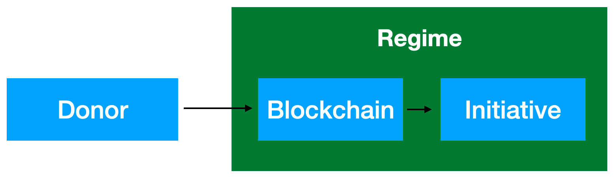

Рэжым у Беларусі злоўжывае кантролем над банкаўскімі рахункамі простых грамадзян, наш праект пабудаваны на тэхналёгіі блокчэйн, якая робіць вашыя сродкі недасягальным для злоўжывальнікаў. Мы так сама працуем над празрыстым і ананімным кіраваннем агульнымі фондамі, і надзейнымі пераводамі ад карыстальніка к карыстальніку.  

