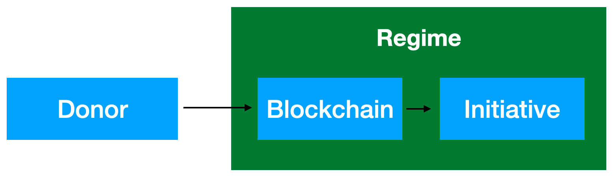

Режим перехватывает денежные потоки взаимопомощи и бесконтрольно распоряжается частными вложениями, конфискуя их в свою пользу

Наш проект "Управление бюджетом" использует технологию блокчейн для совместного децентрализированного управления бюджетом проекта, инициативы, организации и т.д. опираясь на проверенные принципы прозрачности, анонимности и взаимной ответственности участников. Проект обеспечивает бесперебойный и защищённый канал обмена конвертируемыми валютами вне зависимости от местанахождения доноров. 

